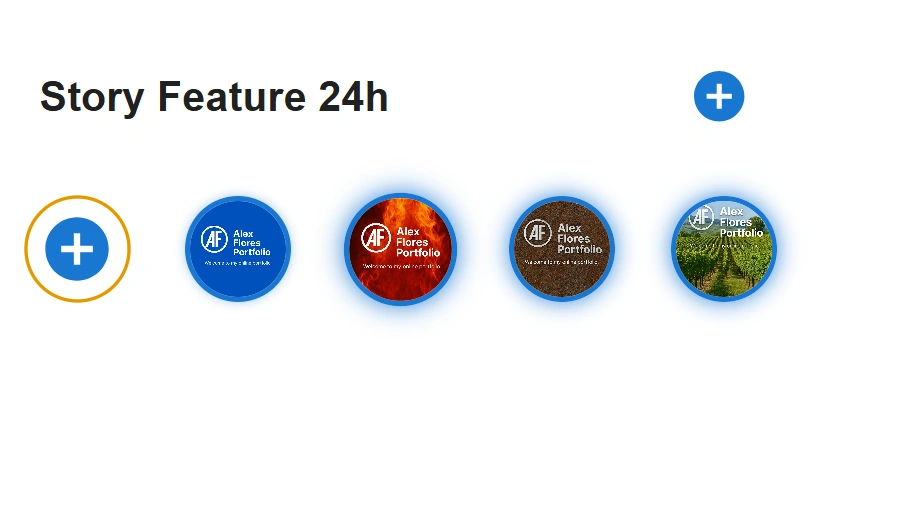

# 📸 Story Feature 24h

A lightweight, client‑side implementation of an ephemeral “Stories” feature inspired by Instagram and WhatsApp.  
Users can upload images that appear as stories and automatically disappear after 24 hours.  
Everything is handled on the **frontend**, using `localStorage` for persistence.

---

## 🚀 Features

- ➕ **Add new stories** through a plus button.
- 🖼️ **Images converted to Base64** and stored in `localStorage`.
- ⏳ **Automatic expiration** after 24 hours.
- 📚 **Story list states**:
    - No stories
    - One story
    - Multiple stories
- ▶️ **Story viewer** with a 3‑second progress bar.
- 🔄 **Swipe navigation** between stories (touch devices).
- 📱 **Fully responsive** layout.
- 📏 **Image size limit**: max **1080 × 1920 px**.

---

## 🧩 How it works

### Uploading a story

- User clicks the **+** button.
- Selects an image.
- The image is converted to **Base64**.
- It is saved in `localStorage` with:
    - A unique `id`
    - A `timestamp` for expiration

### Expiration logic

On every app load:

- All stories are checked.
- If a story is older than **24 hours**, it is removed automatically.

### Viewing stories

- Clicking a story opens the **Story Viewer**.
- A **3‑second progress bar** indicates the active story.
- When the bar completes, the viewer moves to the next story.
- Users can:
    - Tap to skip
    - Swipe to navigate manually

---

## 🛠️ Tech Stack

- **React**
- **JavaScript**
- **CSS**
- **localStorage**

---

## 📂 Project Structure

```plaintext
src/
├── assets/
├── components/
│
├── context/
│
├── hooks/
│
├── StoryBar/
│    │     ├── StoryBar.jsx
│    │     └── StoryBar.css
│    ├── StoryViewer/
│    │     ├── StoryViewer.jsx
│    │     └── StoryViewer.css
│    └── UploadDialog.jsx
├── App.css
├── App.jsx
├── index.css
├── main.jsx
└── index.html
```

---

## 🖼️ Screenshot



---

## 📦 Installation & Usage

```bash
git clone https://github.com/AFloresc/24hr-Story-Feature
cd 24hr-Story-Feature
npm install
npm run dev
```

---

## 📜 Original Requirements

- Story list with a plus button.
- Image upload → Base64 conversion → store in localStorage.
- Auto‑delete after 24 hours.
- Optional swipe navigation.
- Frontend‑only project.
- Responsive design.
- Max image size: 1080 × 1920 px.

---

## 📄 License

This project is released under the MIT License.This project is released under the MIT License.
